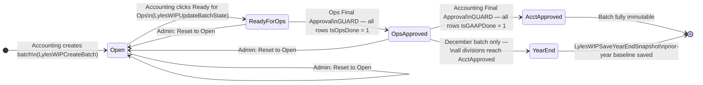

# Auto-WIP Workflow Diagrams
*Web Application — Phase 1*
*Last updated: April 2026*

---

## 1. Batch State Machine

Every WIP batch moves through four states. Guards block advancement until conditions are met.
Admin can reset any non-locked batch back to `Open`.



---

## 2. Full End-to-End Workflow

Actors: **Accounting** (Nicole, Cindy, Brian, Harbir) · **Operations** (PMs, Division Managers) · **System**

```mermaid
flowchart TD
    %% ── Authentication ──────────────────────────────────────────────────────
    LOGIN([User visits app]) --> ENTRA{Entra token\nvalid?}
    ENTRA -- No --> SSO[Redirect to Entra SSO]
    SSO --> ENTRA
    ENTRA -- Yes --> PERMS[Load WipUserPermissions\nAttach WipPrincipal to request]
    PERMS --> DASH[Batch Dashboard\nFiltered to user permissions]

    DASH --> ROLE{Role?}
    ROLE -- Accounting / Admin --> ACCT[All batches visible\nNew Batch button shown]
    ROLE -- Operations --> OPS[ReadyForOps batches visible\nFor permitted divisions only]

    %% ═══════════════════════════════════════════════════════════════════════
    subgraph S1["  STAGE 1 — Accounting: Create & Review  "]
        ACCT --> SEL[Select Company · Month · Division]
        SEL --> CB[LylesWIPCreateBatch\nState = Open]
        CB --> VISTA[Query Vista SQL\nGetWIPDataFromVista\nAccounting only — 10.112.11.8]
        VISTA --> MERGE[Merge LylesWIP overrides\nLylesWIPGetJobOverrides]
        MERGE --> GRID1[Jobs-Ops grid\nRead-only preview]
        GRID1 -.-> CMP1[Jobs-Ops vs GAAP tab\nAvailable read-only]
        GRID1 --> RFO{Ready for Ops?}
        RFO -- No --> GRID1
        RFO -- Yes --> UBS1[LylesWIPUpdateBatchState\nState = ReadyForOps]
        UBS1 --> EMAIL1[/Email → Ops users\nfor company · division\nsmtp.lylesgroup.com/]
    end

    %% ═══════════════════════════════════════════════════════════════════════
    subgraph S2["  STAGE 2 — Operations: Edit & Approve  "]
        EMAIL1 --> LOAD2[Load batch from LylesWIP\nNo Vista connection]
        OPS --> LOAD2
        LOAD2 --> GRID2[Jobs-Ops grid\nYellow columns editable]
        GRID2 --> EDIT2[Edit per row:\nOps Rev · Ops Cost · Bonus/Profit\nCompletion Date · Notes · Close flag]
        EDIT2 --> SAVE2[Auto-save on cell blur\nLylesWIPSaveJobRow\nRecords UpdatedBy + UpdatedAt]
        SAVE2 --> OPDONE{Mark Ops Done?\nCol H checkbox}
        OPDONE -- Check --> OPYES[IsOpsDone = 1]
        OPDONE -- Uncheck --> OPNO[IsOpsDone = 0]
        OPNO --> GRID2
        OPYES --> ALLOP{All rows\nIsOpsDone = 1?}
        ALLOP -- No --> GRID2
        ALLOP -- Yes --> OFABTN[Ops Final Approval\nButton enabled]
        OFABTN --> UBS2[LylesWIPUpdateBatchState\nState = OpsApproved\nJobs-Ops fully locked]
        UBS2 --> EMAIL2[/Email → Accounting users\nfor batch company\nsmtp.lylesgroup.com/]
    end

    %% ═══════════════════════════════════════════════════════════════════════
    subgraph S3["  STAGE 3 — Accounting: GAAP Review & Final Approval  "]
        EMAIL2 --> LOAD3[Open batch\nJobs-Ops tab = read-only\nJobs-GAAP tab = active]
        LOAD3 --> GGRID[Jobs-GAAP grid\nYellow columns editable\nAccounting only]
        GGRID --> COPYQ{Copy Ops to GAAP?}
        COPYQ -- Yes --> COPYSQL[LylesWIP_CopyOpsToGAAP\nScoped to current division\nGrid reloads]
        COPYSQL --> GGRID
        COPYQ -- No --> EDITG[Edit per row:\nGAAP Rev Override\nGAAP Cost Override]
        EDITG --> SAVE3[Auto-save on cell blur\nLylesWIPSaveJobRow\nRecords UpdatedBy + UpdatedAt]
        SAVE3 --> GDONE{Mark GAAP Done?\nCol I checkbox}
        GDONE -- Check --> GYES[IsGAAPDone = 1]
        GDONE -- Uncheck --> GNO[IsGAAPDone = 0]
        GNO --> GGRID
        GYES --> ALLG{All rows\nIsGAAPDone = 1?}
        ALLG -- No --> GGRID
        ALLG -- Yes --> AFABTN[Acct Final Approval\nButton enabled]
        AFABTN --> UBS3[LylesWIPUpdateBatchState\nState = AcctApproved\nBatch fully immutable]
        UBS3 --> DEC{December batch?}
        DEC -- Yes --> ALLDIV{All divisions for\ncompany AcctApproved?}
        ALLDIV -- No --> DEC
        ALLDIV -- Yes --> SNAP[LylesWIPSaveYearEndSnapshot\nPrior-year baseline saved]
        SNAP --> LOCKED[Batch locked forever]
        DEC -- No --> LOCKED
        UBS3 --> EMAIL3[/Email → Accounting users\nFinal Approval Complete\nsmtp.lylesgroup.com/]
    end

    %% ── Cross-cutting: Export ───────────────────────────────────────────────
    GRID1 & GRID2 & GGRID & CMP1 -.->|Any stage| EXPORT([Export to Excel\nClosedXML server-side .xlsx\nYellow fill preserved])

    %% ── Cross-cutting: Admin reset ──────────────────────────────────────────
    UBS1 & UBS2 -. Admin only .-> RESET([Reset batch to Open\nLylesWIPUpdateBatchState])

    %% ── Styles ───────────────────────────────────────────────────────────────
    classDef acct fill:#dbeafe,stroke:#2563eb,color:#1e3a5f
    classDef ops  fill:#dcfce7,stroke:#16a34a,color:#14532d
    classDef email fill:#f3e8ff,stroke:#7c3aed,color:#3b0764
    classDef cross fill:#f8fafc,stroke:#94a3b8,color:#334155

    class SEL,CB,VISTA,MERGE,GRID1,CMP1,RFO,UBS1,LOAD3,GGRID,COPYQ,COPYSQL,EDITG,SAVE3,GDONE,GYES,GNO,AFABTN,UBS3 acct
    class LOAD2,GRID2,EDIT2,SAVE2,OPDONE,OPYES,OPNO,OFABTN,UBS2 ops
    class EMAIL1,EMAIL2,EMAIL3 email
    class EXPORT,RESET cross
```



---

## 3. Data Sources by Stage

| Stage | Vista (10.112.11.8) | LylesWIP (cloud-apps1) |
|-------|---------------------|------------------------|
| Stage 1 — Create batch | Read — `GetWIPDataFromVista` (7-CTE query) | Write — `LylesWIPCreateBatch`, `LylesWIPUpdateBatchState` |
| Stage 1 — Override merge | None | Read — `LylesWIPGetJobOverrides` |
| Stage 2 — Ops load | **None** | Read — `LylesWIPGetJobOverrides` |
| Stage 2 — Ops save | None | Write — `LylesWIPSaveJobRow` (IsOpsDone, overrides) |
| Stage 3 — GAAP load | None | Read — `LylesWIPGetJobOverrides` (GAAP cols) |
| Stage 3 — Copy Ops to GAAP | None | Write — `LylesWIP_CopyOpsToGAAP` |
| Stage 3 — GAAP save | None | Write — `LylesWIPSaveJobRow` (IsGAAPDone, GAAP overrides) |
| Stage 3 — Year-end | None | Write — `LylesWIPSaveYearEndSnapshot` |

**Key constraint:** Vista is only read during Stage 1 batch creation. Operations users have no Vista access and never trigger a Vista query.

---

## 4. Override Merge Priority

When data is loaded for any grid view:

```
Vista-calculated value (baseline)
    ↓
If LylesWIP.WipJobData has a non-NULL override for this job+month → use override
    ↓
Result shown in yellow override column
```

`NULL` in `WipJobData` = no override, show Vista-calculated value.
`Non-NULL with Plugged=1` = user override, takes priority over Vista.
